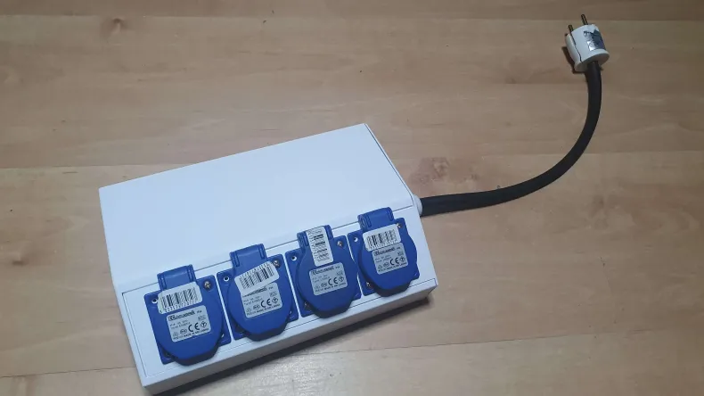
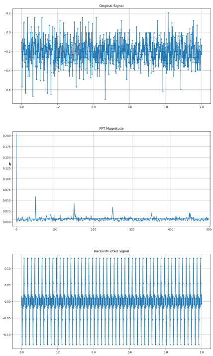
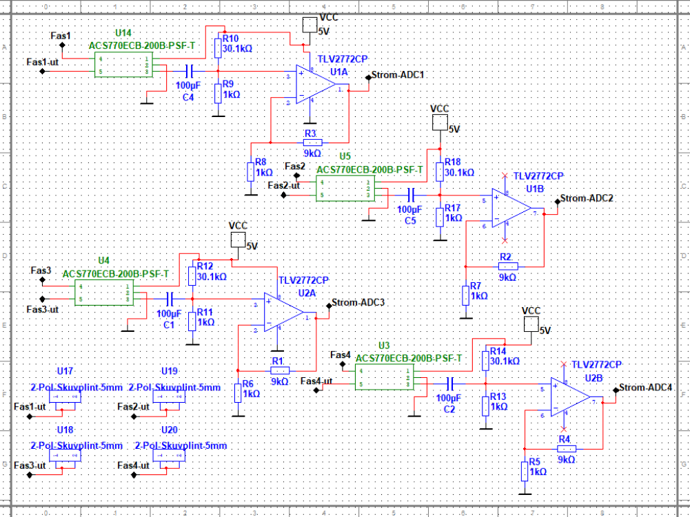

# TaylorMade - General purpose 4 load power monitor 

  
   
  <strong> TaylorMade prototype at rest </strong>  

## Firmware

Current update now samples 5 times as many samples with a total of 100 samples per period compared to the old 20 samples per period. 

Firmware overview:
 - A timer is used to trigger an TRGO interrupt every 200 us 
 - This triggers the ADC to start conversion of 5 channels 
 - The ADC starts then converting all channels once with 20 us / channel (read more in ADC/ folder)
 - ADC stops once 5 channels converted and waits for the next timer interrupt flag
 - Every conversion is stored in a DMA buffer
 - Once DMA buffer has reached 500 samples (100 per channel) an interrupt triggers
 - The DMA ISR converts DMA buffer to byte sized array with a channel identification nibble and sets GPIO ON 
 - RPi has a change-of-state interrupt on the GPIO and sends SPI request
 - Each request triggers an interrupt on the MCU for SPI and the ISR transfers one byte to the RPi
 - For lack of FIFO on SPI slave, shift array to start flag on the RPi
 - Lastly the RPi splits into respective channel buffer based on most significant nibble on reconstructed 16-bit array and initiates calculations 

**NOTE: I have developed the firmware and python scripts in a GNU/Linux enviorment so if new firmware is desired then the Makefile has to be changed**

### Responsible

Firmware by collaborator: RoboKamu (Karzan M.)

## Software

Website complete with the exception of the "history" tab and price estimation. Now uses Waitress, WSGI, instead of running flask debug server. 

The software now uses multiprocessing instead of multithreading for calculations becuase of more demanding calculations, as well as blocking SPI reads. One improvement that can be done is to generate graphs from its own process so that live updates can occur, a nasty work around is to continue updating data but only update graph once refreshed. 

<table>
 <tr>
  <td align="center">
    
     
    Example of the results/output of the filtering process of the ADC values with numpy fft. This step is done prior to Power calculations. This example showcases a signal with a load and a lot of noise. 
   </td>
 </tr>
</table>

<table align="center">
  <tr>
    <td align="center">
      
       
      homepage, port status and control
    </td>
    <td align="center">
      
       
      graphs available on "today" page   visualizing power consumption on loads.   Note: this is a condensed image
    </td>
  </tr>
</table>

### Responsible

Data analysis / calculations, SPI & ISR logic, and server configuration by collaborator: RoboKamu (Karzan M.)

Port status, button logic, UI, and FLASK & GPIO integration  (Python, RPi) by collaborator: Pavel1a 

Flask templates and UI (HTML, CSS, Javascript) by collaborator: Krille04

Logging of values to CSV by collaborator: Adam Younes

## Hardware

<table>
  <tr>
    <td align="center">
      
       
      Current (Hall effect) sensors for ADC input
    </td>
    <td align="center">
      
       
      Relays for RPi GPIO
    </td>
    <td align="center">
      
       
      Voltage divider for AC mains for ADC input
    </td>
  </tr>
  <tr>
    <td colspan="3" align="center">
      <i>Click images for fullscreen</i>
    </td>
  </tr>
</table>

The 4 blue wires on the PCB show the current sensor outputs after the amplifying step and the white wire is the AC mains voltage after the voltage divider step. 

The MCU and RPi is placed on a small prototype board, connected with pin headers. Each input pin on ADC has a pull down resistor to a ground buss. 

### Responsible

Hardware schematic and PCB by collaborator: Skuttispower

## 3D design 

<table>
  <tr>
    <td align="center">
      
       
      Design measurements
    </td>
    <td align="center">
      
       
      Design prototype showcase
    </td>
  </tr>
  <tr>
    <td colspan="2" align="center">
      <i>Click images for fullscreen</i>
    </td>
  </tr>
</table>

### Responsible

3D model made by collaborator: Adam Younes

# Acknoledgements

This project was made possible with the collaboration of Professor Nathaniel Taylor, supervising the usage of AC mains and providing support and ideas. 

Link to professor profile page: [here](https://www.kth.se/profile/taylor/)

# Showcase

https://github.com/user-attachments/assets/2e78821d-a607-4e2f-887a-9635c300f699

This is a compressed demo. First, the user turn on 4 device. Then, the user analyzes the graphs showing voltage, active/reactive/apparent power as well as power factor on the site. Lastly, the user turn off all devices and show all of the power graphs going towards zero. Left side of monitor show a debug terminal displaying the measured power values in clear numbers.  
